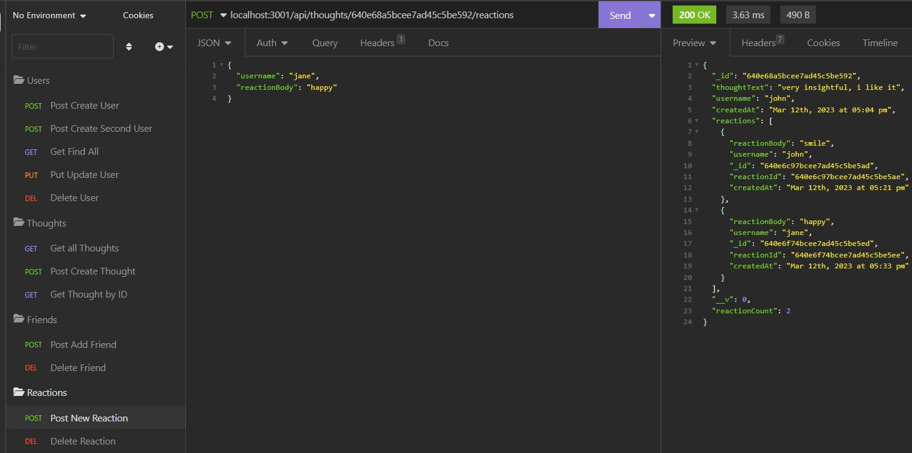

# Module18Social_Media

## Description

Bootcamp: Module 18 Challenge  
NoSQL Challenge: Social Network API  
Codebase correction that follows accessibility standards so that the site is optimized for search engines  

## Table of Contents (Optional)

- [Installation](#Installation)
- [Usage](#Usage)
- [Credits](#Credits)
- [License](#License)

## Installation
open integrated terminal for server.js and run 'npm i'

## Usage
Screenshot of insomnia

Video of readme creation
[Video Demo](https://drive.google.com/file/d/16ZWNK7XOpaeMk6H_2_yVuYEkyR12dxLy/view)

## Credits
sylviapradudy Sept 2020
https://github.com/sylviaprabudy/social-network-api
## License

Please refer to the LICENSE in the repo.
